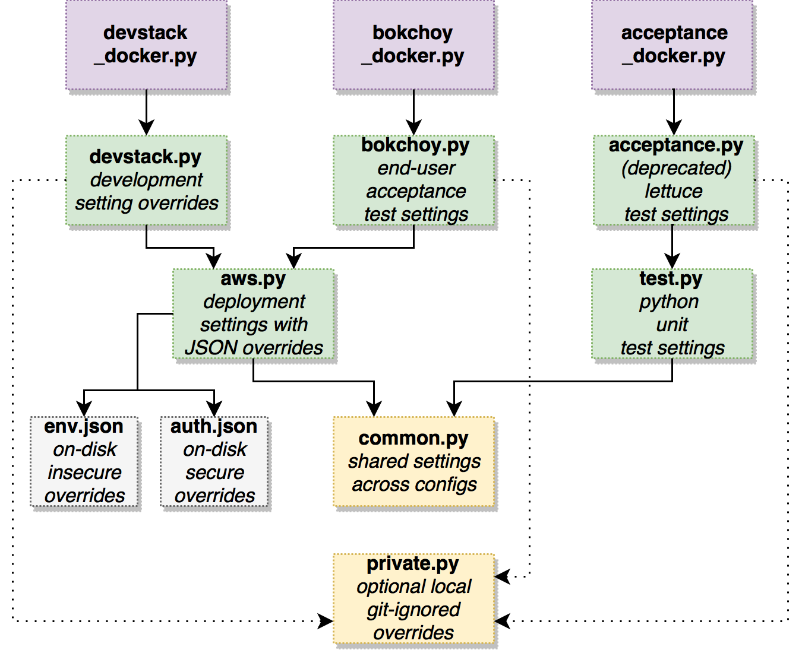

LMS Configuration Settings
==========================

The lms.envs module contains project-wide settings, defined in python modules
using the standard `Django Settings`_ mechanism.

.. _Django Settings: https://docs.djangoproject.com/en/1.11/topics/settings/

Different python modules are used for different setting configuration options.
To prevent duplication of settings, modules import values from other modules,
as shown in the diagram below.

JSON Configuration Files
------------------------

In addition, there is a mechanism for reading and overriding configuration
settings from JSON files on-disk. The :file:`/lms/envs/aws.py` module loads
settings from ``lms.env.json`` and ``lms.auth.json`` files. All
security-sensitive settings and data belong in the ``lms.auth.json`` file, while
the rest are configured via the ``lms.env.json`` file.

These JSON files allow open edX operators to configure the django runtime
without needing to make any changes to source-controlled python files in
edx-platform. Therefore, they are not checked into the edx-platform repo.
Rather, they are generated from the `edxapp playbook in the configuration
repo`_ and available in the ``/edx/app/edxapp/`` folder on edX servers.

.. _edxapp playbook in the configuration repo: https://github.com/edx/configuration/tree/master/playbooks/roles/edxapp

Feature Flags and Settings Guidelines
-------------------------------------

For guidelines on using Django settings and feature flag mechanisms in the edX
platform, please see `Feature Flags and Settings`_.

.. _Feature Flags and Settings: https://openedx.atlassian.net/wiki/spaces/OpenDev/pages/40862688/Feature+Flags+and+Settings+on+edx-platform
